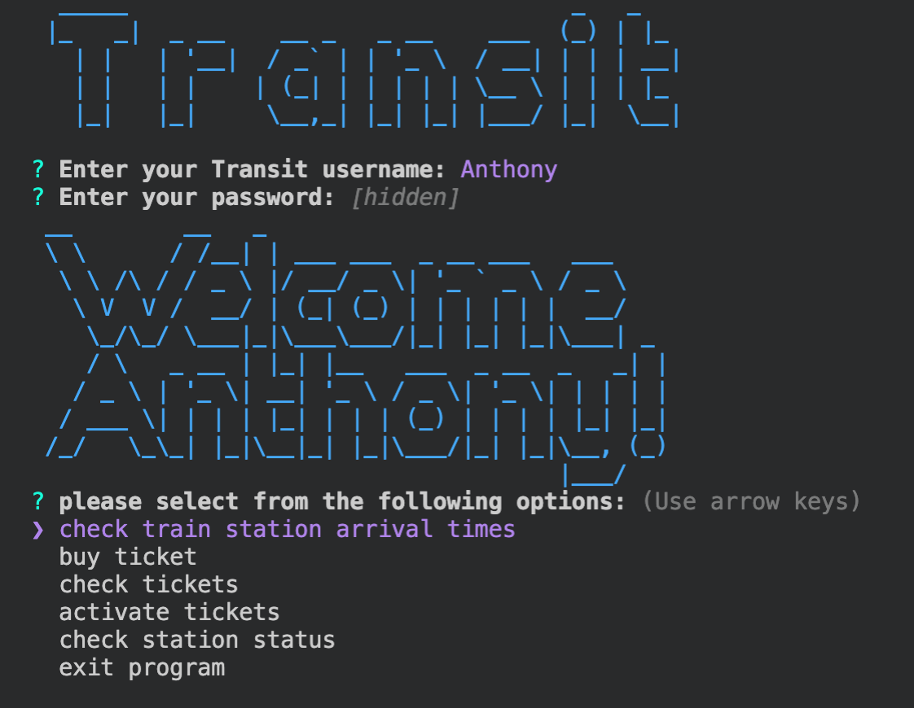

# Introduction
This is a basic CLI tool that allows users to get information about NYC MTA train stations. 

# Set Up
To run this project locally you will first need an MTA API key that you can get by creating an account at https://api.mta.info/#/signup. Then clone this repository, create file named `keys.js` in the main directory, and insert the following code:

```
module.exports = {
  API_KEY: <your-api-key>
}
```
Then install dependencies by running:
```
$ npm install
```
Then to start the app:

```
$ npm run start
```